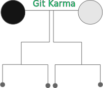

# GitKarma
The open source funding node hierarchy 

#
it's massive idea for good project work around donating system 
by simply break the currency into fragments and distributing it across nodes 
that simplify the software and the standard it's built-on 
for now it's just the idea, for the project development workspace 
is very small and need small team to maintaining it 
all we need is : 

- Hosting server
- SQL database
- Cryptographic
- Banking system
- A social platform

# Request hiring
Email : HalanoSiblee@gmail.com
